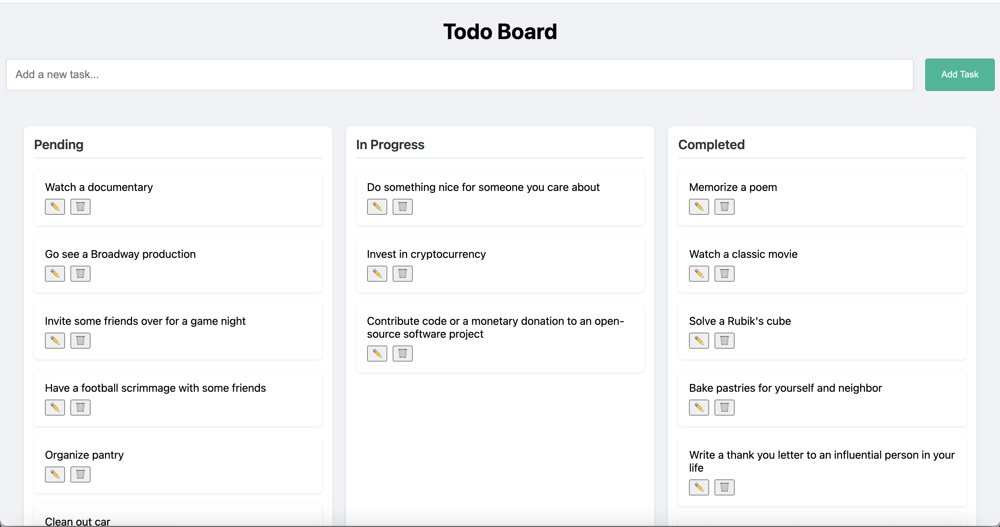
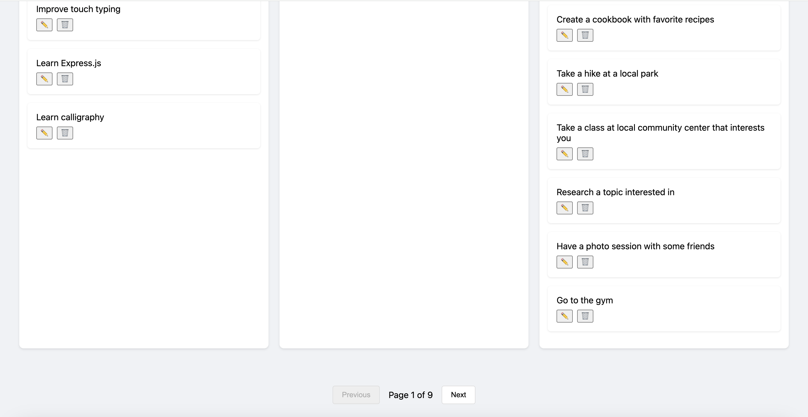
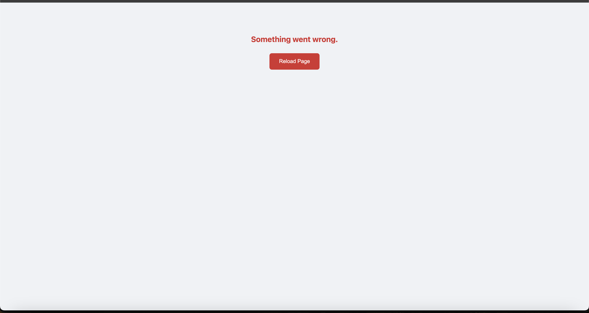

# Todo Board - Trello style

A responsive Kanban-style task management application inspired by Trello, built with React and TypeScript. Manage your tasks across different status lanes with intuitive drag-and-drop functionality and real-time updates.

**Todo Board Demo**  
(Todo Board Live URL: [https://vikgo123.github.io/Trello-style-Todo-Board/](https://vikgo123.github.io/Trello-style-Todo-Board/))  
  


When there is an application rendering error due to an issue, a fallback UI is displayed:  


---

## Table of Contents

- [Features](#features)
- [Technologies](#technologies)
- [Installation](#installation)
- [Project Structure](#project-structure)
- [Usage](#usage)
- [API Integration](#api-integration)
- [Optimizations](#optimizations)
- [Design Decisions & Patterns](#design-decisions--patterns)
- [Known Limitations](#known-limitations)
- [Future Improvements](#future-improvements)
- [Credits](#credits)

---

## Features

- **Kanban Board Interface**
  - Three primary lanes: **Pending**, **In Progress**, and **Completed**
  - Full drag-and-drop support for reordering tasks within a lane and moving tasks between lanes
  - Responsive grid layout that adapts to all screen sizes

- **Todo Management**
  - Create new todos with real-time updates
  - Edit task details with options to save or cancel changes
  - Delete tasks with confirmation prompts
  - Automatic status updates based on drag-and-drop interactions

- **API Integration**
  - Full CRUD operations using the [DummyJSON](https://dummyjson.com/docs/todos) Todo API
  - Supports server-side pagination (30 items per page)
  - Built-in error handling and loading state indicators

- **Performance Optimizations**
  - Components are memoized using `React.memo` to reduce unnecessary re-renders
  - Critical functions (e.g., drag-and-drop handlers) are wrapped with `useCallback`
  - Lazy-loaded components for faster initial load times
  - Smooth CSS transitions for enhanced user experience

- **Advanced Features**
  - Error boundaries for graceful error handling
  - Client-side state synchronization across components
  - Mobile-first, responsive design
  - Ready for deployment on GitHub Pages

---

## Technologies

- **Core:**
  - React 18 + TypeScript
  - Vite Build System
  - [@hello-pangea/dnd](https://www.npmjs.com/package/@hello-pangea/dnd) for drag-and-drop functionality

- **State Management:**
  - React Context API
  - Custom hooks and reducer pattern for managing application state

- **Styling:**
  - CSS Grid and Flexbox layouts
  - Modern CSS transitions and responsive design principles

- **API:**
  - Integration with the DummyJSON Todo API (RESTful service)
  - Pagination and error handling support

---

## Installation

### Prerequisites

- Node.js (version 14 or above)
- npm or yarn package manager

### Steps

1. **Clone the Repository**

   ```bash
   git clone https://github.com/<your-username>/todo-board.git
   cd todo-board
   ```

2. **Install Dependencies**

   ```bash
   npm install
   ```
   or, if you prefer yarn:
   ```bash
   yarn install
   ```

3. **Run the Development Server**

   ```bash
   npm run dev
   ```
   or,
   ```bash
   yarn dev
   ```

4. **Build for Production**

   ```bash
   npm run build
   ```
   or,
   ```bash
   yarn build
   ```

5. **Deploy to GitHub Pages**

   ```bash
   npm run deploy
   ```
   This command uses the `gh-pages` package to push the production build (from the `dist` folder) to a designated branch for GitHub Pages hosting.

---

## Project Structure

```
public/
src/
├── api/
│   ├── todoService.ts    # API service functions for CRUD operations
│   └── types.ts          # Type definitions for todos and API responses
├── components/
│   ├── AddTodo/
│   │   └── AddTodo.tsx   # Component for adding new todos
│   ├── Board/
│   │   └── Board.tsx     # Main board layout managing lanes and todos
│   ├── ErrorBoundary/
│   │   └── ErrorBoundary.tsx  # Component for catching and displaying errors
│   ├── Lane/
│   │   └── Lane.tsx      # Component representing a status lane
│   ├── Pagination/
│   │   └── Pagination.tsx  # Component for paginating todo items
│   └── TodoCard/
│       └── TodoCard.tsx  # Component for an individual todo card
├── context/
│   └── TodoContext.tsx   # Global state management using React Context API
├── hooks/
│   └── useTodos.ts       # Custom hook for managing todos and API interactions
├── constants/
│   └── statuses.ts       # Constants for todo statuses (Pending, In Progress, Completed)
├── styles/
│   └── global.css        # Global CSS styles
├── App.tsx               # Root application component
└── main.tsx              # Entry point for the React application
tsconfig.json
vite.config.ts
package.json
README.md
```

---

## Usage

1. **Adding Todos**
   - Click the **"Add Task"** button.
   - Enter the task text in the input field.
   - Submit the form to create a new todo in the **Pending** lane.

2. **Editing Todos**
   - Click the ✏️ (edit) icon on a todo card.
   - Modify the text in the input field.
   - Click **Save** to update the todo or **Cancel** to discard changes.

3. **Moving Todos**
   - Drag and drop a todo card to reorder tasks within the same lane or to move it across different lanes.
   - The application automatically updates the task’s status based on its new lane:
     - **Pending** → **In Progress** (client-side update)
     - **In Progress** ↔ **Completed** (triggers an API update)

4. **Deleting Todos**
   - Click the 🗑️ (delete) icon on a todo card.
   - The task is removed from the board immediately upon confirmation.

5. **Pagination**
   - Navigate between pages using the **Previous** and **Next** buttons.
   - The board displays up to 30 tasks per page and shows the total count of tasks.

---

## API Integration

The application leverages the DummyJSON Todo API to manage tasks.

**Endpoints:**

- `GET /todos` – Fetch a paginated list of todos.
- `POST /todos/add` – Create a new todo.
- `PUT /todos/{id}` – Update an existing todo.
- `DELETE /todos/{id}` – Delete a todo.

**Pagination:**

- Uses `limit` and `skip` query parameters to manage pagination.
- Client-side state is synchronized with the server’s responses to ensure consistency.

---

## Optimizations

1. **Performance**
   - **Memoization:** Components (such as lanes and cards) are wrapped with `React.memo` to avoid unnecessary re-renders.
   - **useCallback:** Critical functions (e.g., drag-and-drop handlers) are memoized with `useCallback`.
   - **Lazy Loading:** Components are lazy-loaded where appropriate to improve initial load performance.
   - **CSS Transitions:** Smooth animations are implemented using hardware-accelerated CSS transitions.

2. **Error Handling**
   - **Error Boundaries:** The application uses error boundaries to catch and display fallback UIs in case of rendering errors.
   - **API Error Management:** All API calls include error handling to manage network issues or server errors gracefully.

3. **Best Practices**
   - The application is written in TypeScript to ensure type safety.
   - A modular component structure (following atomic design principles) enhances maintainability.
   - Clear separation of concerns between the UI, API layer, and state management improves scalability.

---

## Design Decisions & Patterns

- **Component-Based Architecture:**  
  The entire UI is built using React's component model, allowing for modular, reusable pieces that encapsulate both logic and presentation.

- **Container/Presentational Pattern:**  
  Business logic is isolated in container components (using React Context and custom hooks), while presentational components focus solely on rendering the UI. This separation improves maintainability and testability.

- **React Context API & Custom Hooks:**  
  Global state management is achieved using the Context API, which is further abstracted by custom hooks (e.g., `useTodos`) to manage API calls and state updates in a clean and reusable manner.

- **Error Boundaries:**  
  To ensure graceful degradation, error boundaries are used to catch rendering errors and display fallback UIs, thus preventing the entire application from crashing.

- **Lazy Loading & Code Splitting:**  
  Components are dynamically imported using React’s `lazy` and `Suspense` to reduce the initial bundle size and improve performance.

- **Optimistic UI & Client-Side Synchronization:**  
  Changes in the UI (such as task movements) are reflected immediately on the client side, with asynchronous API calls synchronizing the state. This approach provides a smooth user experience even when network latency is present.

- **Design for Responsiveness:**  
  A mobile-first, responsive design ensures the application works well across various devices and screen sizes.

---

## Known Limitations

- **API Constraints:**
  - The **"In Progress"** status is primarily managed on the client side.
  - User authentication is not supported.
  - Data is sourced from DummyJSON (i.e., mock data), which might not reflect real-world scenarios.

- **Pagination:**
  - Fixed page size (30 items per page) with no option for custom page numbers.
  - Basic client-side filtering is implemented; advanced search functionality is lacking.

- **Data Persistence:**
  - No local storage caching is implemented; data resets on page reload.

---

## Future Improvements

- [ ] Implement real-time collaboration features.
- [ ] Add due dates and deadlines for tasks.
- [ ] Introduce task prioritization.
- [ ] Integrate user authentication.
- [ ] Support labels and tags for categorization.
- [ ] Develop a robust search functionality.
- [ ] Implement an undo/redo feature.
- [ ] Enable data export/import functionality.

---

## Credits

- **Todo API:** Provided by [DummyJSON](https://dummyjson.com)
- **UI Inspiration:** [Trello](https://trello.com)
- **Drag and Drop:** Powered by [@hello-pangea/dnd](https://www.npmjs.com/package/@hello-pangea/dnd)
- **Build System:** Vite
- **Languages:** React, TypeScript, CSS